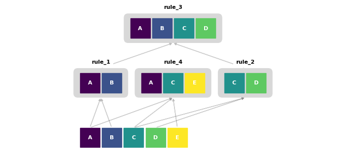

# MDL Grammar Induction

A Python implementation of a **Minimum Description Length (MDL)** based grammar induction model. This tool automatically discovers hierarchical structures and recurring patterns within sequences of symbols, effectively "learning" a context-free grammar that best compresses the input data.


## Overview

This project implements a greedy optimization algorithm  that iteratively replaces frequent patterns with new rules. Unlike standard compression, this model uses the MDL principle to ensure that the "cost" of the grammar (the dictionary) does not outweigh the "savings" from compressing the sequence.

### Key Features:
* **Automatic Pattern Discovery:** Identifies bi-grams, tri-grams, and higher-order n-grams.
* **Hierarchical Structure:** Rules can reference other rules, building a nested tree of dependencies.
* **MDL Optimization:** Balances sequence length reduction against grammar complexity.
* **Rule Pruning:** Automatically removes redundant or unused rules to maintain a lean model.
* **Visual Analysis:** Built-in tools  to visualize the grammar hierarchy.

---

## How it Works

The model minimizes the total **Description Length** ($DL$), defined by the formula:

$$ \mathrm{DL} = L(\mathrm{Data} | \mathrm{Model}) + \lambda \cdot L(\mathrm{Model})$$

Where:
* **$L(\mathrm{Data} | \mathrm{Model})$**: The bits required to encode the sequence using the current vocabulary.
* **$L( \mathrm{Model})$**: The bits required to encode the grammar rules (the "dictionary").
* **$\lambda$**: The `mdl_model_cost` hyperparameter that weights the grammar complexity.

---

## Usage Example

```python
from grammar_model import GrammarModel

# Define a sequence with motifs: (A,B), (C,D), (A,B,C,D) and (A,C,E)
sequence = [*['A','B','C','D','|']*4, *['A','B']*3, *['C','D']*3, *['A','C','E']*2]

# Initialize the model
grammar_model = GrammarModel(
    sequence, 
    separator='|', 
    mdl_model_cost=0.3, 
    rule_len_min=2, 
    rule_len_max=5
)

# Fit the grammar and show steps
grammar_model.fit(rule_label='rule', verbose=True)

# Visualize the induction result
plot_grammar_expanded(grammar_model)
```



---

## Installation

```bash
git clone [https://github.com/DavideNuzzi/MDL_Grammar_Induction.git](https://github.com/DavideNuzzi/MDL_Grammar_Induction.git)
cd MDL_Grammar_Induction
pip install -r requirements.txt
```